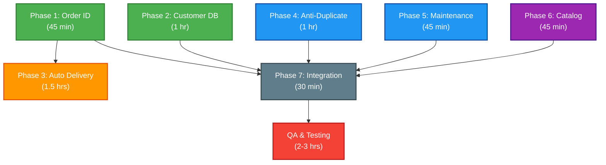

# Sprint 2 & Operations — Complete Planning & Todo Guide

**Consolidated from 3 documents**  
**Generated**: May 13, 2026  
**Status**: Implementation Ready

---

## Table of Contents

1. [Executive Overview](#executive-overview)
2. [Existing Features Audit](#existing-features-audit)
3. [Sprint 2 Scope & Phases](#sprint-2-scope--phases)
4. [Phase-by-Phase Breakdown](#phase-by-phase-breakdown)
5. [Master Todo List](#master-todo-list)
6. [Execution Timeline](#execution-timeline)
7. [Dependencies & Sequencing](#dependencies--sequencing)
8. [Decisions Required](#decisions-required)

---

# Executive Overview

## Current Status (May 13, 2026)

```
HypeBotX Production System
├─ Ticket System: ✅ ACTIVE
├─ Order System: ✅ ACTIVE (HYP-format ready for Phase 1)
├─ Payment System: ✅ ACTIVE
├─ Stock Management: ✅ ACTIVE (Sprint 1 Complete)
├─ Joki Queue: ✅ ACTIVE
├─ Music System: ⛔ DISABLED (intentional)
├─ Moderation: ✅ ACTIVE
├─ Verify System: ✅ ACTIVE
└─ Warranty: ✅ ACTIVE
```

## Sprint 2 Goals

**NOT a rebuild sprint** — existing features are mature and verified. Sprint 2 is **pure automation & enhancement**:

1. **Phase 1-2**: Core Enhancement (Order ID, Customer DB)
2. **Phase 3**: New Feature (Auto Delivery)
3. **Phase 4-6**: Safety & UX (Anti-Duplicate, Maintenance, Catalog)
4. **Phase 7**: Integration (Final wiring)

**Estimated Total Effort**: ~6 hours of development

---

# Existing Features Audit

## Confirmed Active Features ✅

| # | Feature | Status | Evidence |
|---|---------|--------|----------|
| 1 | **Ticket Transcript** | ✅ Active | Auto-generated on close ticket |
| 2 | **Logging / Error Bot** | ✅ Active | `loggingService.js` — ticket, order, payment, moderation, error, transcript |
| 3 | **Backup / Persistence** | ✅ Active | `/backup-structure`, `/restore-structure`, auto backup job |
| 4 | **Role & Permission Guard** | ✅ Active | `permissionGuard.js`, `permissionCheck.js` — owner/staff, verified, joki crew, music controller |
| 5 | **Staff/Admin Commands** | ✅ Active | `/stafflog`, `/audit`, `/note`, `/blacklist`, `/salesreport`, `/paymentcheck`, `/orderlist`, `/updateorder`, `/updatequeue` |
| 6 | **Warranty Basic** | ✅ Active | Warranty claim modal, warranty ticket, accept/reject/need-proof buttons |
| 7 | **Payment Proof Basic** | ✅ Active | Image upload in ticket → auto-detect → approve/reject buttons |
| 8 | **Claim & Close Ticket** | ✅ Active | Claim button, confirm close dialog, transcript on close |
| 9 | **Joki Queue System** | ✅ Active | Auto-queue after payment, claim/start/finish buttons, queue sweep job |
| 10 | **Music System** | ⛔ DISABLED | Intentionally turned off |
| 11 | **Moderation** | ✅ Active | Anti-flood, mass mention detection, timeout |
| 12 | **Verify System** | ✅ Active | Verify button panel, role assignment |

## Stock Management — Sprint 1 Complete ✅

All commands built, verified, and active:

| Command | File | Status |
|---------|------|--------|
| `/stock-add` | `src/commands/store/stockAdd.js` | ✅ Digital multi-line + non-digital quantity |
| `/stock-list` | `src/commands/store/stockList.js` | ✅ Masked values, available count, inactive filtered |
| `/stock-edit` | `src/commands/store/stockEdit.js` | ✅ Metadata-only, SKU immutable |
| `/stock-remove` | `src/commands/store/stockRemove.js` | ✅ Soft-void default, reserved/sold protected |
| `/stock-update` | `src/commands/store/stockUpdate.js` | ✅ Announcement command |
| Repository | `src/repositories/stockRepository.js` | ✅ StockUnit lifecycle (available/reserved/sold/void) |

---

# Sprint 2 Scope & Phases

## What Needs to be BUILT / ENHANCED

### Tier 1 — Core Sprint 2 (BUILD NOW)

| # | Feature | Type | Priority | Detail |
|---|---------|------|----------|--------|
| 1 | **Auto Order ID Generator** | 🆕 Enhancement | **HIGH** | Current: `ORD-{ticketId}` inconsistent. Target: `HYP-0001` sequential |
| 2 | **Customer Database / Profile** | 🆕 Enhancement | **HIGH** | Add: total spent, warranty history, tier, `/customer-profile` command |
| 3 | **Auto Delivery Digital** | 🆕 New | **HIGH** | After payment `paid` → auto send key/license via DM using StockUnit |
| 4 | **Anti Duplicate Payment** | 🆕 New | **MEDIUM** | Detect same proof image, prevent double-approve, warn staff |
| 5 | **Maintenance Mode** | 🆕 New | **MEDIUM** | `/maintenance on/off`, block customer orders, allow staff |
| 6 | **Service Catalog** | 🆕 Enhancement | **LOW** | `/setprice` enhancement: category grouping, SKU link, active toggle |

### Tier 2 — Backlog (POST Sprint 2)

| # | Feature | Priority | Notes |
|---|---------|----------|-------|
| 7 | Auto Payment Check QRIS/Mutasi | 🔜 Next Sprint | Requires external API integration (bank/QRIS) |
| 8 | Komisi / Rekap Penjoki | 🔜 Next Sprint | Need joki order data aggregation |
| 9 | Owner Dashboard Web | 🔜 Later | Full web panel, significant effort |
| 10 | SOP / Terms Accept Button | 🔜 Later | Button before order, store terms text |
| 11 | Queue Estimation (admin only) | ⏭️ Optional | Internal ETA for admin, not public |

---

# Phase-by-Phase Breakdown

## Phase 1: Auto Order ID Generator (`HYP-XXXX`)

**Estimated**: ~45 minutes | **Type**: Enhancement | **Dependency**: None

### Current State
- `orderService.js L279`: `id: ORD-${ticket.id}` (ticket-based)
- `orderService.js L407`: `id: ORD-${ticket.id}` (same)
- `storeOpsService.js L181`: `id: ORD-${Date.now()}` (timestamp-based, **INCONSISTENT!**)

### What We're Building

Auto-incrementing order IDs using a simple counter:
```
HYP-0001
HYP-0002
HYP-0003
...
HYP-9999
```

### Implementation

**1a. Add counter to `simpleStoreRepository.js`:**

```javascript
async getNextOrderId(guildId) {
    const key = `orderCounter_${guildId}`;
    const current = await database.read(key, { counter: 0 });
    const next = current.counter + 1;
    await database.write(key, { counter: next });
    return `HYP-${String(next).padStart(4, "0")}`;
}
```

**1b. Update all 3 order creation sites** to use `getNextOrderId()`:
- `src/services/orderService.js` (2 call sites)
- `src/services/storeOpsService.js` (1 call site)

**1c. Backward compatibility:**
- Old `ORD-*` IDs remain valid in queries
- No migration needed
- New orders start with `HYP-0001`

### Files to Modify

- `src/repositories/simpleStoreRepository.js` — Add method
- `src/services/orderService.js` — Update 2 call sites
- `src/services/storeOpsService.js` — Update 1 call site

### Testing

```bash
# Create 5 test orders, verify:
# HYP-0001, HYP-0002, HYP-0003, HYP-0004, HYP-0005
/order create customer:@user service:test
```

---

## Phase 2: Customer Database / Profile Detail

**Estimated**: ~1 hour | **Type**: Enhancement | **Dependency**: None

### Current State

**User model** (`src/database/models/User.js`):
- `userId`, `username`, `totalOrder`, `status` (normal/blacklist), `blacklistReason`

**Existing repo** (`src/repositories/userRepository.js`):
- `find()`, `upsert()`, `incrementOrder()`

**Existing commands**:
- `/blacklist` — Sets status to "blacklist"
- No customer profile view
- No tier system
- No warranty/dispute tracking

### What We're Building

**Customer card with full history:**
- Total orders, total spent, tier (new/regular/vip)
- Warranty/dispute/refund count
- Last 5 orders
- Staff notes
- Status (normal/blacklist)

### Implementation

**2a. Extend `User.js` model** — add 6 new fields:

```diff
 totalOrder: payload.totalOrder || 0,
+totalSpent: payload.totalSpent || 0,
 status: payload.status || "normal",
+tier: payload.tier || "new",               // new | regular | vip
 blacklistReason: payload.blacklistReason || "",
+warrantyCount: payload.warrantyCount || 0,
+disputeCount: payload.disputeCount || 0,
+refundCount: payload.refundCount || 0,
+lastOrderAt: payload.lastOrderAt || null,
+notes: payload.notes || "",
```

**2b. Extend `userRepository.js`** — add helper methods:

```javascript
async incrementWarranty(guildId, userId)
async incrementDispute(guildId, userId)
async incrementRefund(guildId, userId)
async setTier(guildId, userId, tier)      // new | regular | vip
async getTopCustomers(guildId, limit)     // For reports
async updateLastOrderAt(guildId, userId)
async setNotes(guildId, userId, notes)
```

**2c. Create `/customer-profile` command** — shows customer card:

```
/customer-profile user:@customer

┌─────────────────────────────────────┐
│ 👤 Customer Profile                 │
├─────────────────────────────────────┤
│ Username: john_doe                  │
│ Status: NORMAL                      │
│ Tier: REGULAR ⭐⭐                   │
│                                     │
│ 📊 Statistics                       │
│ Total Orders: 12                    │
│ Total Spent: Rp 2,500,000          │
│ Last Order: 2 days ago              │
│                                     │
│ ⚠️ Metrics                          │
│ Warranty Claims: 2                  │
│ Disputes: 0                         │
│ Refunds: 0                          │
│                                     │
│ 📝 Recent Orders                    │
│ 1. HYP-0098 - Windows 10 (DELIVERED)│
│ 2. HYP-0097 - Discord Boost (DELIVERED) │
│ 3. HYP-0096 - PSN Card (PENDING)    │
│                                     │
│ 💬 Staff Notes                      │
│ VIP customer, fast payer            │
└─────────────────────────────────────┘
```

**2d. Create `/customer-set` command** — staff sets tier/status/notes:

```
/customer-set user:@customer tier:vip
/customer-set user:@customer notes:Fast payer, reliable
/customer-set user:@customer status:blacklist reason:Fraud attempt
```

**2e. Auto-update hooks** — plug into existing order flow:
- When order created → `updateLastOrderAt()`
- When warranty claimed → `incrementWarranty()`
- When dispute opened → `incrementDispute()`
- When refund issued → `incrementRefund()`

**2f. Auto tier system** — optional logic:
- `totalSpent >= 5,000,000` → Tier: VIP
- `totalSpent >= 1,000,000` → Tier: REGULAR
- else → Tier: NEW

### Files to Create

- `src/commands/admin/customerProfile.js` — View profile
- `src/commands/admin/customerSet.js` — Edit profile

### Files to Modify

- `src/database/models/User.js` — Add 6 fields
- `src/repositories/userRepository.js` — Add 8 methods
- `src/services/orderService.js` — Hook `updateLastOrderAt()`
- `src/services/warrantyService.js` — Hook `incrementWarranty()`
- `src/services/disputeService.js` — Hook `incrementDispute()`

### Testing

```bash
# Create order as customer
/order create customer:@user service:test

# Check profile
/customer-profile user:@user
# Should show: totalOrder: 1, lastOrderAt: now, totalSpent updated

# Set tier
/customer-set user:@user tier:vip notes:"Great customer"

# Check profile again
/customer-profile user:@user
# Should show: tier: VIP, notes: "Great customer"
```

---

## Phase 3: Auto Delivery Produk Digital

**Estimated**: ~1.5 hours | **Type**: New Feature | **Dependency**: Phase 1

### Current State

**Stock system ready:**
- StockUnit lifecycle: `available` → `reserved` → `sold`
- `/stock-add` with digital multi-line input
- `/stock-list` with masking

**Payment flow exists:**
- `paymentService.js` — handles approval
- `storeOpsService.js` — handles payment check
- Trigger points: `approvePaymentFromTicketId()`, `paymentCheck()`

**Missing:**
- No delivery service
- No auto DM to customer
- No digital value transmission

### What We're Building

**Auto delivery chain after payment approved:**

```
Payment Status → PAID
  ↓
Find Item by SKU
  ↓
Check deliveryType === "auto"
  ↓
Get Available Unit (from stock)
  ↓
RESERVE Unit (status: reserved)
  ↓
Send DM to Customer with value
  ↓
On Success: Mark SOLD (status: sold)
On Failure: REVERT to available, Alert staff
```

### Implementation

**3a. Create `deliveryService.js`:**

```javascript
// Core methods:
async deliverDigitalUnit(guildId, customerId, orderRecord)
  → Find item by SKU
  → Get available unit
  → Reserve unit
  → Send DM with valueEncrypted
  → Mark SOLD on success
  → REVERT on failure

async revertDelivery(guildId, unitId)
  → Change status: reserved → available

async getDeliveryStatus(guildId, orderId)
  → Check unit status for order
```

**Key safety guards:**
- Anti-double delivery: check if `soldToOrderId` already set
- DM failure handling: revert to `available`, never lose stock
- Log everything: delivery success/fail logged to admin channel
- Masking: only log masked value in staff channel, never full

**3b. Hook into existing payment flow:**

Update `paymentService.js`:
```javascript
// After payment approved and status synced to "paid"
async approvePaymentFromTicketId(...) {
    // ... existing approval logic ...
    // NEW: Trigger auto-delivery
    await deliveryService.deliverDigitalUnit(guildId, customerId, orderRecord);
}
```

Update `storeOpsService.js`:
```javascript
// In paymentCheck() after status update
if (newPaymentStatus === "paid") {
    await deliveryService.deliverDigitalUnit(guildId, customerId, orderRecord);
}
```

**3c. Add `sku` field to Order model** — link order to stock item:

```javascript
{
    id: "HYP-0001",
    customerId: "123456789",
    ticketId: "T-001",
    sku: "WIN10PRO-01",  // NEW: Link to stock item
    totalPrice: "99.99",
    status: "pending" | "paid" | "delivered",
    // ... rest of fields
}
```

**3d. Create `/delivery-status` command** — staff checks delivery:

```
/delivery-status order:HYP-0098

Status: DELIVERED
SKU: WIN10PRO-01
Unit ID: SU-1234567-890
Status: sold
Delivered At: 2026-05-13 10:30 UTC
Proof: ✅ DM sent to customer
```

**3e. Create `/delivery-manual` command** — staff manual deliver if auto fails:

```
/delivery-manual order:HYP-0098

Manually deliver unit to customer:
1. Get available unit
2. Reserve it
3. Send value manually
4. Confirm delivery

✅ Unit SU-1234567-890 marked as sold
```

### Files to Create

- `src/services/deliveryService.js` — Core delivery logic
- `src/commands/admin/deliveryStatus.js` — Check delivery status
- `src/commands/admin/deliveryManual.js` — Manual delivery fallback

### Files to Modify

- `src/database/models/Order.js` — Add `sku` field
- `src/services/paymentService.js` — Hook delivery after approval
- `src/services/storeOpsService.js` — Hook delivery after paymentCheck
- `src/app.js` — Wire deliveryService

### Testing

```bash
# 1. Add digital stock
/stock-add category:test sku:TESTKEY1 name:"Test Key" type:digital \
  deliverytype:auto \
  valueencr:"KEY123\nKEY456"

# 2. Create order with SKU
/order create customer:@user service:test sku:TESTKEY1

# 3. Create payment with proof
[Upload proof image to ticket]

# 4. Approve payment
[Click approve button]

# 5. Check delivery
/delivery-status order:HYP-0001
# Should show: Status: DELIVERED, unit marked as sold

# 6. Check DM to customer
# Customer should receive: "Here's your key: KEY123"
```

---

## Phase 4: Anti Duplicate Payment / Double Order

**Estimated**: ~1 hour | **Type**: New Feature | **Dependency**: None (Phase 3 compatible)

### Current State

**Payment proof system:**
- Image upload in ticket
- Auto-detect valid image
- Approve/reject buttons
- No duplicate URL check
- No double-approve guard

**Issues:**
- Same image can be uploaded twice → double approve → double charge
- No warning if same payment proof used for different orders
- No recovery if accidentally approved twice

### What We're Building

**Three-layer duplicate protection:**

1. **URL-level**: Detect same image URL
2. **Order-level**: Prevent same order approved twice
3. **Status-level**: Block re-delivery if already delivered

### Implementation

**4a. Add `findByProofUrl()` helper** to paymentRepository:

```javascript
async findByProofUrl(guildId, proofUrl) {
    // Search all payments for this URL
    // Return first match or null
}
```

**4b. Duplicate proof URL detection** in `handlePaymentProofMessage()`:

```javascript
async handlePaymentProofMessage(...) {
    const proofUrl = extractImageUrl(message);
    
    // NEW: Check for duplicate
    const existingPayment = await paymentRepo.findByProofUrl(guildId, proofUrl);
    if (existingPayment && existingPayment.status === "paid") {
        return interaction.reply({
            content: `⚠️ **DUPLICATE PROOF ALERT**\n` +
                    `This proof image was already used for order ${existingPayment.orderId}\n` +
                    `Allow staff to review manually.`,
            ephemeral: true
        });
    }
    
    // ... continue normal flow
}
```

**4c. Double-approve guard** in `approvePaymentFromTicketId()`:

```javascript
async approvePaymentFromTicketId(guildId, ticketId, staffId) {
    const payment = await paymentRepo.findByTicketId(ticketId);
    
    // NEW: Check if already paid
    if (payment.status === "paid") {
        throw new Error(
            `❌ Cannot approve twice!\n` +
            `Payment already approved and order marked as paid.\n` +
            `If customer has issues, create NEW ticket for refund/dispute.`
        );
    }
    
    // ... continue
}
```

**4d. Same-ticket double payment guard:**

```javascript
async handlePaymentProofMessage(...) {
    const ticketRecord = await ticketRepo.findById(ticketId);
    
    // NEW: Check if ticket already has paid payment
    const existingPayment = await paymentRepo.findByTicketId(ticketId);
    if (existingPayment && existingPayment.status === "paid") {
        return interaction.reply({
            content: `⚠️ **ORDER ALREADY PAID**\n` +
                    `This ticket's order (${existingPayment.orderId}) was already paid.\n` +
                    `Staff can still review this proof, but won't affect order.`,
            ephemeral: true
        });
    }
    
    // ... continue
}
```

**4e. Extend Order model** — add fields:

```javascript
{
    id: "HYP-0001",
    customerId: "123456789",
    status: "pending" | "paid" | "delivered",
    proofUrl: "https://cdn.../image.jpg",  // NEW: Store first proof URL
    approvedAt: null,                       // NEW: When approved
    approvedBy: null,                       // NEW: Staff who approved
}
```

### Files to Modify

- `src/repositories/paymentRepository.js` — Add `findByProofUrl()` method
- `src/services/paymentService.js` — Add 3 guards in handlers
- `src/database/models/Order.js` — Add `proofUrl`, `approvedAt`, `approvedBy`

### Testing

```bash
# 1. Upload proof image
[Upload image to ticket]

# 2. Try upload same image again in another ticket
[Upload same image]
# Should show: ⚠️ DUPLICATE PROOF ALERT

# 3. Approve first payment
[Click approve]

# 4. Try approve payment again in same ticket
[Click approve button on same payment]
# Should show: ❌ Cannot approve twice!

# 5. Upload new proof for different order
[Upload different image]
# Should allow (no duplicate detected)
```

---

## Phase 5: Maintenance Mode

**Estimated**: ~45 minutes | **Type**: New Feature | **Dependency**: None

### Current State

No way to pause customer access while keeping staff operations running.

### What We're Building

**Maintenance mode:**
- Block customer-facing commands
- Allow staff commands
- Show custom maintenance message
- Prevent order creation during maintenance

### Implementation

**5a. Maintenance flag** in `storeSettings`:

```javascript
{
    guildId: "123456789",
    maintenanceMode: false,              // NEW
    maintenanceMessage: "🔧 Toko sedang maintenance...",  // NEW
    maintenanceStartedAt: null,          // NEW
    maintenanceStartedBy: null,          // NEW
}
```

**5b. `/maintenance` command** (owner only):

```
/maintenance mode:[on|off] message:[optional]

Examples:
/maintenance mode:on message:Restocking, back in 30 mins
/maintenance mode:off
```

**5c. Maintenance guard middleware**:

Block customer access:
- `/order create`
- `/ticket create`
- `/payment`
- All `/price`, `/faq`, `/help` still work (info-only)

Allow staff:
- All admin commands work
- All approvals work
- All queries work

Allow owner:
- Everything (already has access)

**5d. Hook into button handler** — block order/ticket buttons for non-staff:

```javascript
// In buttonHandler.js
async handleButton(...) {
    if (isMaintenance && !isStaff && isOrderButton) {
        return interaction.reply({
            content: `🔧 ${maintenanceMessage}`,
            ephemeral: true
        });
    }
    
    // ... continue
}
```

### Files to Create

- `src/commands/admin/maintenance.js` — Toggle maintenance
- `src/middlewares/maintenanceGuard.js` — Check maintenance status

### Files to Modify

- `src/database/models/StoreSettings.js` — Add 4 fields
- `src/handlers/buttonHandler.js` — Add guard before processing
- `src/handlers/commandHandler.js` — Add guard before executing
- `src/repositories/storeSettingsRepository.js` — Add setters

### Testing

```bash
# 1. Turn ON maintenance
/maintenance mode:on message:Server maintenance, back soon

# 2. Try create order (customer)
/order create customer:@me service:test
# Should show: 🔧 Server maintenance, back soon

# 3. Try admin command (staff)
/orderlist
# Should work normally

# 4. Turn OFF maintenance
/maintenance mode:off

# 5. Try create order (customer)
/order create customer:@me service:test
# Should work normally
```

---

## Phase 6: Service Catalog Enhancement

**Estimated**: ~45 minutes | **Type**: Enhancement | **Dependency**: None

### Current State

**Existing price list:**
- `/setprice` — simple name/price/description
- `/price` — flat list display
- No categories, no SKU link, no active toggle

### What We're Building

**Enhanced catalog:**
- Group by category
- Link to stock items (show availability)
- Active/inactive toggle
- Display order

### Implementation

**6a. Extend priceList schema:**

```diff
 {
     id: "PL-123",
     guildId: "123456789",
     name: "Windows 10 Pro",
     price: "99.99",
     description: "Full license key",
+    category: "software",        // NEW
+    sku: "WIN10PRO-01",          // NEW (link to stock)
+    isActive: true,              // NEW
+    sortOrder: 10,               // NEW
 }
```

**6b. Add category/sku options** to `/setprice`:

```
/setprice name:Windows price:99.99 category:software sku:WIN10PRO-01

Or edit existing:
/setprice name:Windows category:software isactive:false
```

**6c. Update `/price`** — grouped by category with stock:

```
📦 SOFTWARE
├─ Windows 10 Pro
│  Price: Rp 99.999
│  Available: 5 units
│  Status: 🟢 In Stock
├─ Office 365
│  Price: Rp 149.999
│  Available: 3 units
│  Status: 🟢 In Stock

🎮 GAMING
├─ PlayStation Plus
│  Price: Rp 199.999
│  Available: 0 units
│  Status: 🔴 Out of Stock
```

**6d. Sort by category, then sortOrder:**

```javascript
priceList
    .filter(p => p.isActive)
    .sort((a, b) => {
        if (a.category !== b.category) return a.category.localeCompare(b.category);
        return a.sortOrder - b.sortOrder;
    })
```

### Files to Modify

- `src/database/models/PriceList.js` — Add 4 fields
- `src/services/storeOpsService.js` — Update pricing logic
- `src/commands/admin/setPrice.js` — Add options
- `src/commands/customer/price.js` — Add grouping + stock check

### Testing

```bash
# 1. Add service with category and SKU
/setprice name:Windows category:software sku:WIN10PRO-01 price:99999

# 2. Add another with category
/setprice name:PSN category:gaming sku:PSN-JP-3M price:199999

# 3. View price list
/price

# Expected: Grouped by category (GAMING, SOFTWARE), showing stock availability

# 4. Deactivate a price
/setprice name:Windows isactive:false

# 5. View again
/price
# Should not show Windows
```

---

## Phase 7: Integration Wiring

**Estimated**: ~30 minutes | **Type**: Integration | **Dependency**: All Phases

### Tasks

- [ ] Wire `deliveryService` in `app.js`
- [ ] Register new commands in command registry
- [ ] Register new middlewares in app initialization
- [ ] Update command deploy list
- [ ] Update Panduan Final with new commands
- [ ] Create QA test matrix
- [ ] Deploy to staging
- [ ] Run full integration test

### Deployment Checklist

- [ ] All 6 new files created
- [ ] All modifications tested individually
- [ ] Phase integration tested
- [ ] No console errors on bot startup
- [ ] All commands load properly
- [ ] Database migrations applied
- [ ] QA sign-off
- [ ] Production deployment

---

# Master Todo List

## ✅ COMPLETED (From TODO.md)

- [x] Hard-disable fitur musik: matikan creation service dan musicCleanupJob
- [x] Update semua slash command musik agar langsung menolak dengan pesan fitur dimatikan
- [x] Pastikan tidak ada crash jika `client.container.services.musicService` tidak ada

---

## 🔄 IN PROGRESS / TODO — Sprint 2 Implementation

### Phase 1: Order ID Generator

- [ ] Add `getNextOrderId()` to `simpleStoreRepository.js`
- [ ] Update `orderService.js` L279 to use new generator
- [ ] Update `orderService.js` L407 to use new generator
- [ ] Update `storeOpsService.js` L181 to use new generator
- [ ] Test: Create 5 orders, verify HYP-0001 through HYP-0005
- [ ] Test: Verify backward compatibility with old ORD-* IDs

### Phase 2: Customer Database

- [ ] Extend `User.js` with 6 new fields (totalSpent, tier, warrantyCount, disputeCount, refundCount, lastOrderAt, notes)
- [ ] Extend `userRepository.js` with 8 new methods
- [ ] Create `/customer-profile` command
- [ ] Create `/customer-set` command
- [ ] Hook `updateLastOrderAt()` in `orderService.js`
- [ ] Hook `incrementWarranty()` in warranty service
- [ ] Hook `incrementDispute()` in dispute service
- [ ] Test: Create order, check profile, verify lastOrderAt updated
- [ ] Test: Set tier, check profile, verify tier changed

### Phase 3: Auto Delivery

- [ ] Create `deliveryService.js` with core logic
- [ ] Add `sku` field to `Order.js` model
- [ ] Hook delivery in `paymentService.js` after approval
- [ ] Hook delivery in `storeOpsService.js` after paymentCheck
- [ ] Create `/delivery-status` command
- [ ] Create `/delivery-manual` command for manual fallback
- [ ] Test: Add digital stock, create order, approve payment, check DM to customer
- [ ] Test: Verify unit status changed to sold
- [ ] Test: Verify anti-double-delivery guards
- [ ] Test: Verify DM failure handling (revert to available)

### Phase 4: Anti-Duplicate Payment

- [ ] Add `findByProofUrl()` to paymentRepository
- [ ] Add URL duplicate check in `handlePaymentProofMessage()`
- [ ] Add double-approve guard in `approvePaymentFromTicketId()`
- [ ] Add same-ticket guard in payment handler
- [ ] Add `proofUrl`, `approvedAt`, `approvedBy` to `Order.js`
- [ ] Test: Upload same image twice, verify warning
- [ ] Test: Approve payment, try approve again, verify error
- [ ] Test: Two different payments with different images, verify both allowed

### Phase 5: Maintenance Mode

- [ ] Add maintenance fields to `StoreSettings.js`
- [ ] Create `/maintenance` command
- [ ] Create `maintenanceGuard.js` middleware
- [ ] Hook guard into `commandHandler.js`
- [ ] Hook guard into `buttonHandler.js`
- [ ] Test: Turn on maintenance, try customer order, verify blocked
- [ ] Test: Staff command still works
- [ ] Test: Turn off maintenance, customer order works again

### Phase 6: Service Catalog

- [ ] Add 4 fields to `PriceList.js` (category, sku, isActive, sortOrder)
- [ ] Add options to `/setprice` command
- [ ] Update `/price` display with grouping
- [ ] Add stock availability check in `/price`
- [ ] Test: Add prices with categories, verify grouped display
- [ ] Test: Deactivate price, verify hidden in `/price`

### Phase 7: Integration & Deployment

- [ ] Wire all new services in `app.js`
- [ ] Register all new commands
- [ ] Register all new middlewares
- [ ] Update command deploy list
- [ ] Update documentation
- [ ] Full system test (all phases together)
- [ ] QA sign-off
- [ ] Deploy to production

---

# Execution Timeline

## Recommended Sequencing

```
Day 1 (Today - May 13)
├─ Phase 1: Order ID (45 min) ✓
└─ Phase 2: Customer DB (1 hr) ✓

Day 2 (May 14)
├─ Phase 3: Auto Delivery (1.5 hr)
├─ Phase 4: Anti-Duplicate (1 hr)
└─ Testing Phase 3-4 (30 min)

Day 3 (May 15)
├─ Phase 5: Maintenance (45 min)
├─ Phase 6: Catalog (45 min)
└─ Phase 7: Integration (1 hr)

Day 4 (May 16)
├─ Full QA (2-3 hrs)
├─ Bug fixes
└─ Production deployment
```

## Parallel Tasks

**CAN be done in parallel:**
- Phase 1 + Phase 2 (independent)
- Phase 4 + Phase 5 + Phase 6 (independent from each other)
- Phase 3 can start once Phase 1 done

**MUST be sequential:**
- Phase 1 before Phase 3 (Phase 3 needs HYP-XXXX format)
- Phase 7 after all phases (final integration)

---

# Dependencies & Sequencing

## Dependency Graph



## Task Checklist by Dependency

### Can Start Immediately (No Dependencies)
- [ ] Phase 1: Order ID
- [ ] Phase 2: Customer DB
- [ ] Phase 5: Maintenance
- [ ] Phase 6: Catalog

### Can Start After Phase 1
- [ ] Phase 3: Auto Delivery

### Can Start After Phase 3
- [ ] Phase 4: Anti-Duplicate (optional, can do in parallel)

### Must Do Last
- [ ] Phase 7: Integration & Wiring
- [ ] QA & Testing

---

# Decisions Required

Before starting implementation, confirm these decisions:

| # | Question | Options | Recommendation | Decision |
|---|----------|---------|-----------------|----------|
| 1 | Order ID digit count | 4-digit (`HYP-0001`) vs 5-digit (`HYP-00001`) | 4-digit (cleaner) | ☐ 4-digit ☐ 5-digit |
| 2 | Auto delivery target | DM customer OR post in ticket channel | DM customer (private) | ☐ DM ☐ Ticket |
| 3 | Maintenance blocking | Hard block (error) OR soft block (warning) | Hard block (respect maintenance) | ☐ Hard ☐ Soft |
| 4 | Auto tier system | Implement auto tier based on spending OR manual only | Auto tier (less admin work) | ☐ Auto ☐ Manual |
| 5 | Category required | Force category when adding price OR optional | Optional (backwards compat) | ☐ Required ☐ Optional |
| 6 | Staff can override maintenance | Can staff see customer cmds during maintenance OR completely blocked | Staff can override | ☐ Can override ☐ Blocked |
| 7 | Archive old orders | Keep all orders OR archive old ones | Keep all (for audit trail) | ☐ Keep all ☐ Archive |

---

## Summary

**Total Effort**: ~6-7 hours of development  
**Files Created**: 8 new  
**Files Modified**: ~15 existing  
**Testing Time**: 2-3 hours  
**Deployment**: Same day after QA  

**GO LIVE TARGET**: May 16, 2026

---

**Last Updated**: May 13, 2026  
**Status**: READY FOR IMPLEMENTATION
